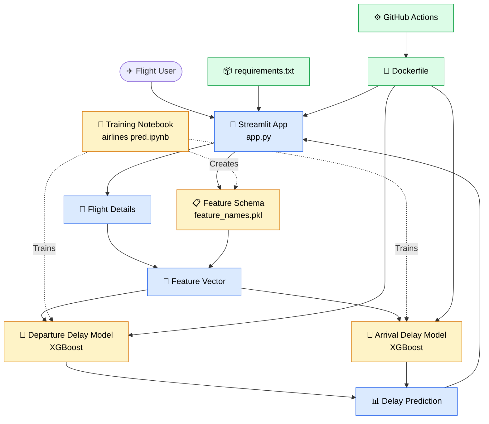

# 🏗️ Repository Architecture

```mermaid
flowchart TD
    User([✈️ Flight User])

    App["📱 Streamlit App<br/>app.py"]
    Input["📝 Flight Details"]
    Features["🔢 Feature Vector"]

    Schema["📋 Feature Schema<br/>feature_names.pkl"]
    DepModel["🤖 Departure Delay Model<br/>XGBoost"]
    ArrModel["🤖 Arrival Delay Model<br/>XGBoost"]
    Prediction["📊 Delay Prediction"]

    Notebook["📓 Training Notebook<br/>airlines pred.ipynb"]
    Docker["🐳 Dockerfile"]
    Requirements["📦 requirements.txt"]
    CI["⚙️ GitHub Actions"]

    User --> App
    App --> Input
    Input --> Features

    Schema --> Features
    App --> Schema

    Features --> DepModel
    Features --> ArrModel
    DepModel --> Prediction
    ArrModel --> Prediction
    Prediction --> App

    Notebook -. Trains .-> DepModel
    Notebook -. Trains .-> ArrModel
    Notebook -. Creates .-> Schema

    Requirements --> App

    Docker --> App
    Docker --> DepModel
    Docker --> ArrModel
    CI --> Docker

    classDef app fill:#DBEAFE,stroke:#2563EB,color:#000;
    classDef model fill:#FEF3C7,stroke:#D97706,color:#000;
    classDef infra fill:#DCFCE7,stroke:#16A34A,color:#000;

    class App,Input,Features,Prediction app;
    class Schema,DepModel,ArrModel,Notebook model;
    class Docker,Requirements,CI infra;
```
