# Flight Delay Prediction — Professional Architecture Overview

```mermaid
flowchart LR

    %% Layer 1: User interaction
    subgraph UX["1. User Experience"]
        U(["✈️ Flight User"])
        A["📱 Streamlit App<br/>Python entry point<br/><b>app.py</b>"]
        I["📝 Flight Details"]
        P["📊 Delay Prediction"]
    end

    %% Layer 2: Feature preparation
    subgraph FEAT["2. Feature Pipeline"]
        F["🔢 Feature Vector"]
        S["📋 Feature Schema<br/><b>feature_names.pkl</b>"]
    end

    %% Layer 3: Model inference
    subgraph ML["3. Prediction Layer"]
        D["🤖 Departure Delay Model<br/><b>XGBoost Regressor</b><br/>flight_departure_delay_model.pkl"]
        R["🤖 Arrival Delay Model<br/><b>XGBoost Regressor</b><br/>flight_arrival_delay_model.pkl"]
    end

    %% Layer 4: Training and delivery
    subgraph OPS["4. Training & Deployment"]
        N["📓 Training Notebook<br/><b>airlines pred.ipynb</b>"]
        REQ["📦 Dependencies<br/><b>requirements.txt</b>"]
        DOCKER["🐳 Container Image<br/><b>Dockerfile</b>"]
        CI["⚙️ GitHub Actions<br/><b>ci.yml</b>"]
    end

    %% Core prediction workflow
    U -->|"uses"| A
    A -->|"collects"| I
    I -->|"prepared as"| F
    S -->|"aligns feature ordering"| F
    A -->|"loads schema"| S
    F -->|"predicts with"| D
    F -->|"predicts with"| R
    D -->|"departure estimate"| P
    R -->|"arrival estimate"| P
    P -->|"rendered in app"| A

    %% Training, packaging, and deployment relationships
    N -.->|"trains"| D
    N -.->|"trains"| R
    N -.->|"generates"| S
    REQ -.->|"configures runtime"| A
    DOCKER -->|"packages"| A
    DOCKER -->|"packages"| D
    DOCKER -->|"packages"| R
    DOCKER -->|"installs"| REQ
    CI -->|"builds or deploys"| DOCKER

    %% Clickable repository links
    click A "https://github.com/cnadupuri/Flight-Delay-Prediction/blob/main/app.py" "Open Streamlit application"
    click S "https://github.com/cnadupuri/Flight-Delay-Prediction/blob/main/feature_names.pkl" "Open feature schema"
    click D "https://github.com/cnadupuri/Flight-Delay-Prediction/blob/main/flight_departure_delay_model.pkl" "Open departure delay model"
    click R "https://github.com/cnadupuri/Flight-Delay-Prediction/blob/main/flight_arrival_delay_model.pkl" "Open arrival delay model"
    click N "https://github.com/cnadupuri/Flight-Delay-Prediction/blob/main/airlines%20pred.ipynb" "Open training notebook"
    click REQ "https://github.com/cnadupuri/Flight-Delay-Prediction/blob/main/requirements.txt" "Open dependency manifest"
    click DOCKER "https://github.com/cnadupuri/Flight-Delay-Prediction/blob/main/Dockerfile" "Open Dockerfile"
    click CI "https://github.com/cnadupuri/Flight-Delay-Prediction/blob/main/.github/workflows/ci.yml" "Open CI/CD workflow"

    %% Styling
    classDef user fill:#F8FAFC,stroke:#475569,stroke-width:2px,color:#0F172A;
    classDef ui fill:#DBEAFE,stroke:#2563EB,stroke-width:2px,color:#172554;
    classDef feature fill:#E0F2FE,stroke:#0284C7,stroke-width:2px,color:#0C4A6E;
    classDef model fill:#FEF3C7,stroke:#D97706,stroke-width:2px,color:#78350F;
    classDef ops fill:#DCFCE7,stroke:#16A34A,stroke-width:2px,color:#14532D;

    class U user;
    class A,I,P ui;
    class F,S feature;
    class D,R model;
    class N,REQ,DOCKER,CI ops;

    style UX fill:#F8FAFC,stroke:#94A3B8,stroke-width:1.5px;
    style FEAT fill:#EFF6FF,stroke:#60A5FA,stroke-width:1.5px;
    style ML fill:#FFFBEB,stroke:#F59E0B,stroke-width:1.5px;
    style OPS fill:#F0FDF4,stroke:#22C55E,stroke-width:1.5px;
```

## Architecture Layers

- **User Experience:** Collects flight details and displays predictions through Streamlit.
- **Feature Pipeline:** Applies the serialized feature schema to produce an aligned model input vector.
- **Prediction Layer:** Uses separate XGBoost regressors for departure and arrival delay estimates.
- **Training & Deployment:** Trains the models, manages dependencies, builds the container, and runs CI/CD automation.

## Linked Components

- [Streamlit application](app.py)
- [Feature schema](feature_names.pkl)
- [Departure delay model](flight_departure_delay_model.pkl)
- [Arrival delay model](flight_arrival_delay_model.pkl)
- [Training notebook](airlines%20pred.ipynb)
- [Dependencies](requirements.txt)
- [Dockerfile](Dockerfile)
- [GitHub Actions workflow](.github/workflows/ci.yml)
