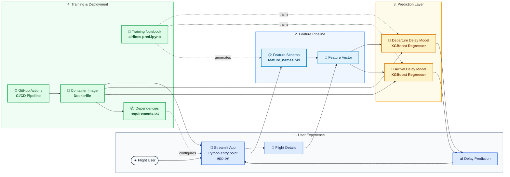

# Flight Delay Prediction — Professional Architecture Overview

This architecture captures the full lifecycle of the flight delay prediction system: the user submits flight inputs, the app prepares feature vectors using a schema, XGBoost models predict departure and arrival delays, and the project is trained, packaged, and automated through Docker and GitHub Actions.
